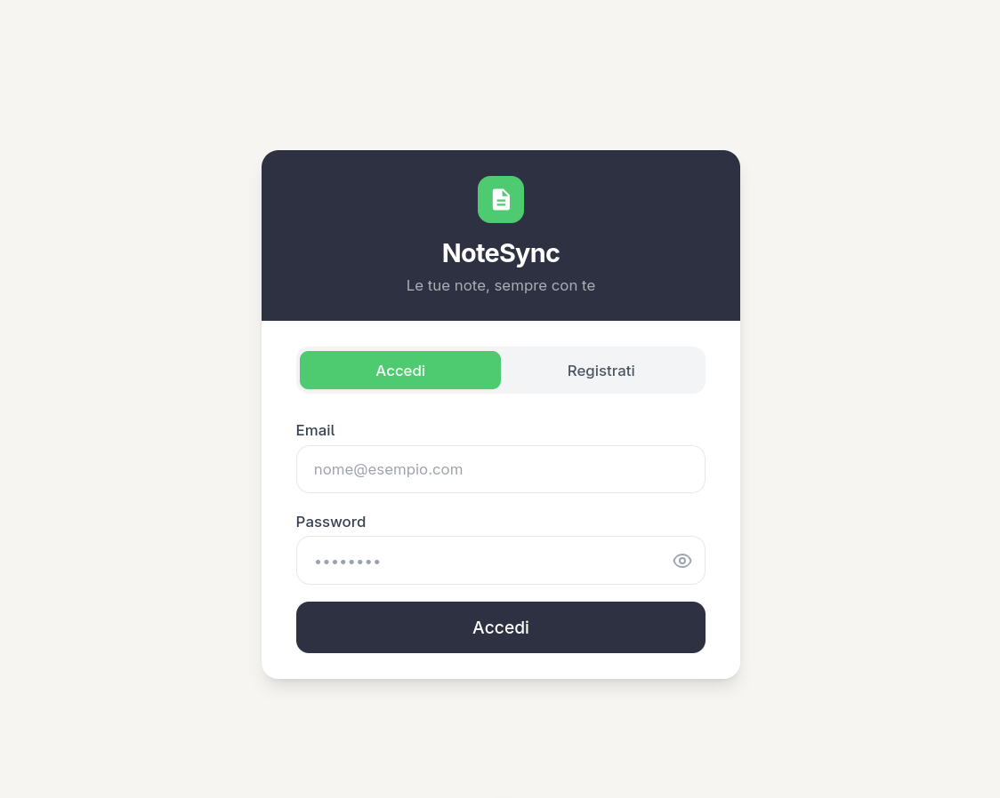
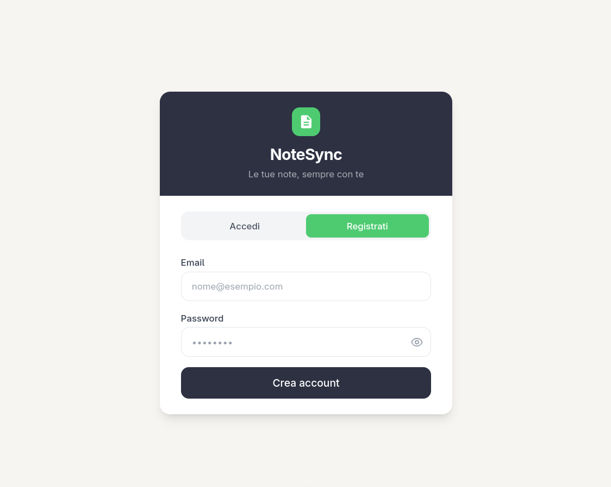
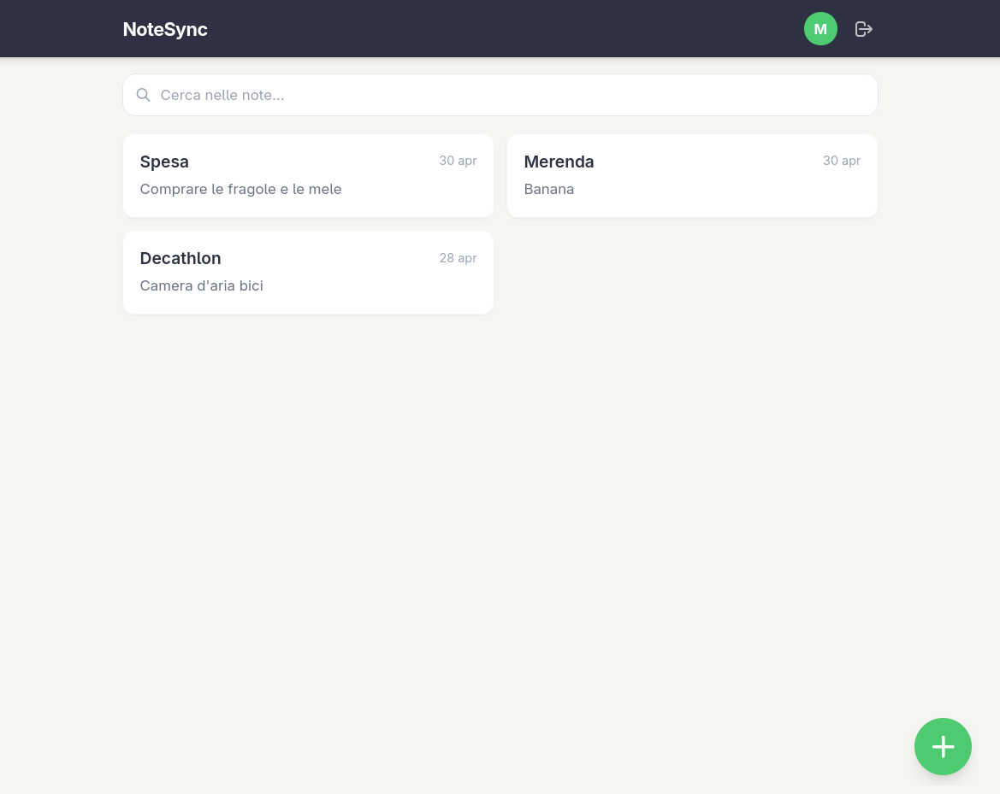
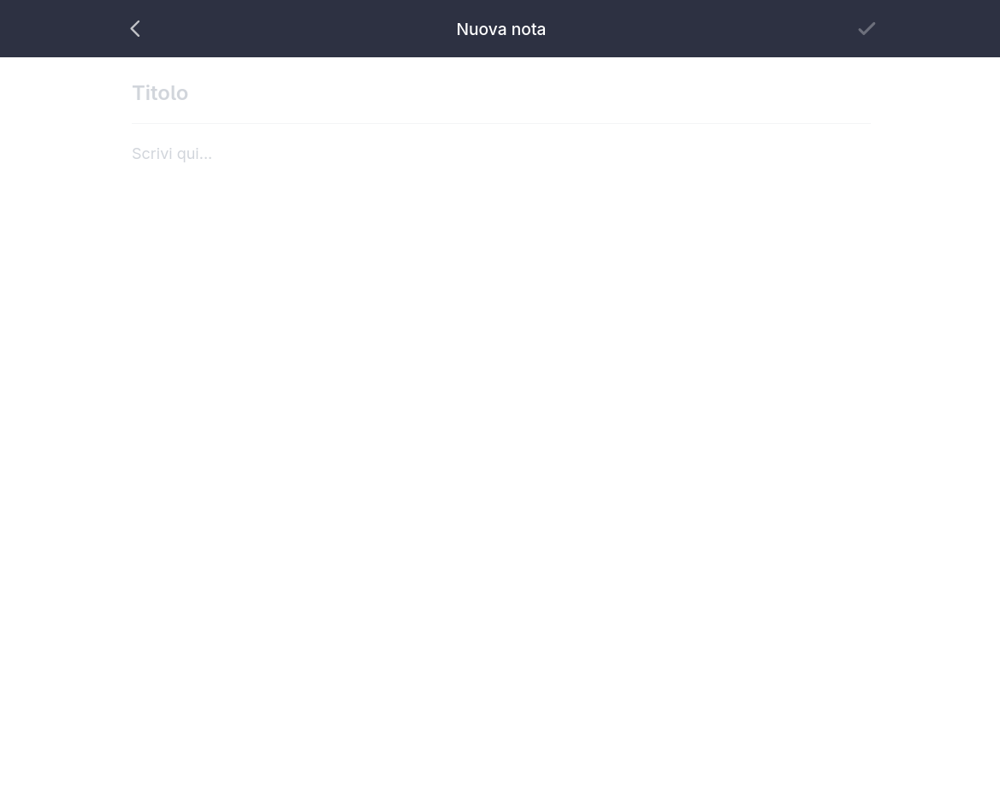
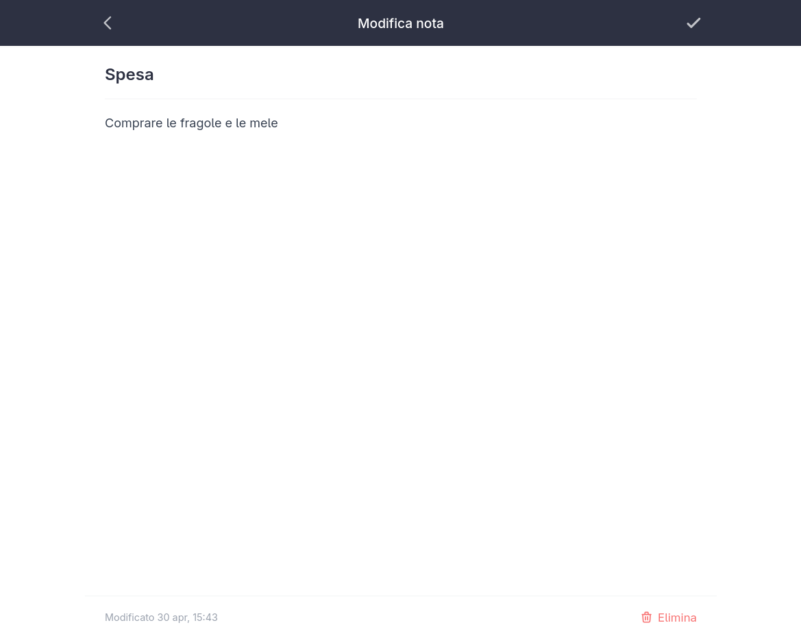
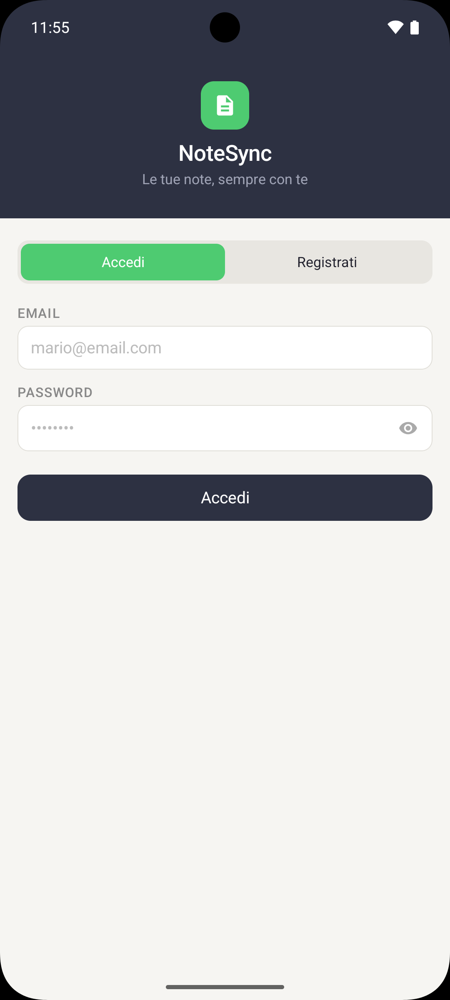
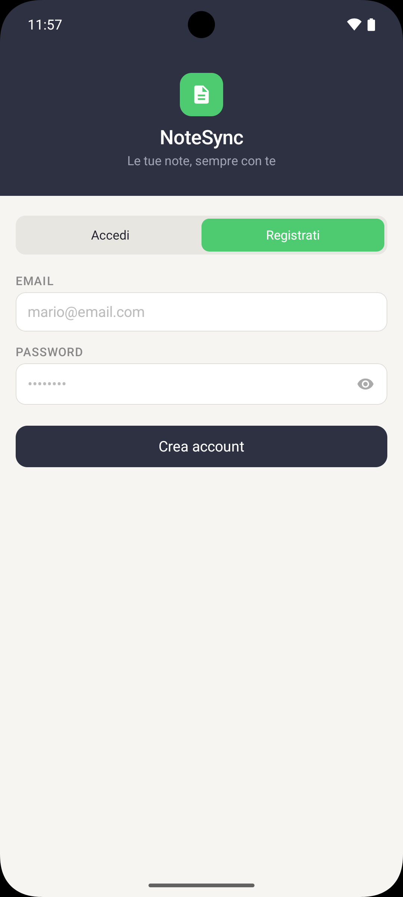
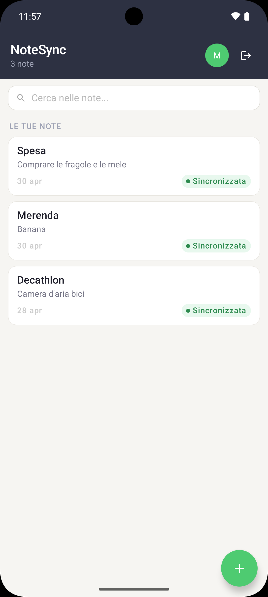
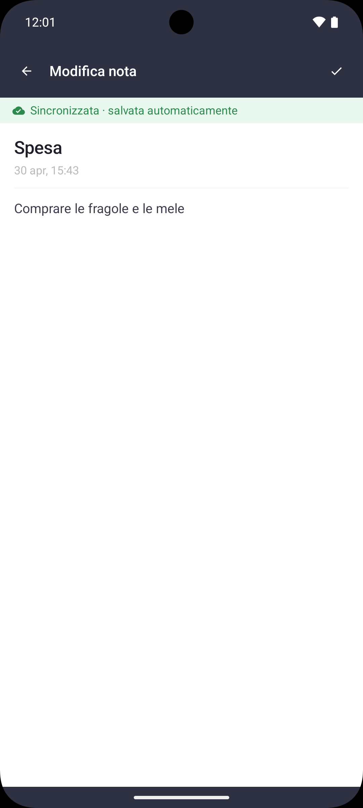

# NoteSync

NoteSync is a full-stack note-taking application that keeps your notes synchronized across Android and web in real time.

The project covers the entire development stack — from a REST API with JWT authentication, to a responsive web interface, to a native Android app with offline support.

**[Live Demo](https://https://notesync-508vsehx4-simone-ruggeris-projects.vercel.app)** | **[Download APK](https://github.com/simone-ruggeri/notesync/releases/latest)**

## Features
- 🔐 **Authentication** – Secure register and login with JWT tokens and bcrypt password hashing.
- 📝 **Note Management** – Create, edit, and delete notes from both web and Android.
- 🔄 **Real-time Sync** – Notes are always consistent across platforms via a shared REST API.
- 📶 **Offline Support** – The Android app caches notes locally with Room, making them accessible without a connection.

## Tech Stack

### Backend
- **Kotlin + Ktor** – Lightweight, async REST API server
- **PostgreSQL + Exposed** – Relational database with Kotlin ORM
- **HikariCP** – Connection pooling for efficient database access
- **JWT + jBCrypt** – Stateless authentication with hashed passwords
- **Docker** – Containerized local setup via Docker Compose

### Web
- **Nuxt 3 + Vue 3** – Single-page application with file-based routing
- **Pinia** – State management for auth and notes
- **Tailwind CSS** – Utility-first styling

### Android
- **Kotlin + Jetpack Compose** – Declarative native UI
- **Retrofit** – HTTP client for API communication
- **Room** – Local database for offline caching
- **DataStore** – Persistent JWT token storage
- **Koin** – Dependency injection

## Architecture

The backend follows a layered architecture with distinct **Routes**, **Repositories**, and **Models**. The Android app follows the **MVVM (Model–View–ViewModel)** pattern:

- **View**: Jetpack Compose screens observe UI state reactively.
- **ViewModel**: Manages business logic and exposes state via `StateFlow`.
- **Model**: Room handles local persistence; Retrofit handles remote sync.

Dependency injection is implemented with **Koin**, keeping modules decoupled and testable.

## Screenshots
### Web

#### Authentication
Register and login screens on web.

<p>
  
  
</p>


### Notes
Note list, creation, and editing.

<p>
  
  
  
</p>

### Android
#### Authentication
Register and login screens on Android.
<p>
  
  
</p>

### Notes
Note list, creation, and editing.
<p>
  
  
  
</p>


## Local Setup

**Requirements:** Docker, Node.js 20+, Android Studio

### Backend + Database
```bash
cp docker/.env.example docker/.env
# Edit docker/.env with your own secrets
cd docker && docker compose up
```
Backend runs at `http://localhost:8080`.

### Web
```bash
cd web && npm install && npm run dev
```
Web runs at `http://localhost:3000`.

### Android
Open `android/` in Android Studio and run on emulator or device.
The debug build connects to `http://10.0.2.2:8080` (emulator localhost).

## Environment Variables

| Variable | Used by | Description |
|----------|---------|-------------|
| `DB_URL` | Backend | JDBC connection string |
| `DB_USER` | Backend | Database user |
| `DB_PASS` | Backend | Database password |
| `JWT_SECRET` | Backend | Signing secret (min 32 chars) |
| `FRONTEND_URL` | Backend | Web app URL for CORS |
| `NUXT_PUBLIC_API_BASE` | Web | Backend URL |

See `docker/.env.example` for a local template.

## Author
[Simone Ruggeri](https://github.com/simone-ruggeri)
